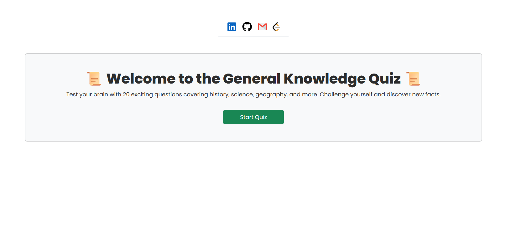
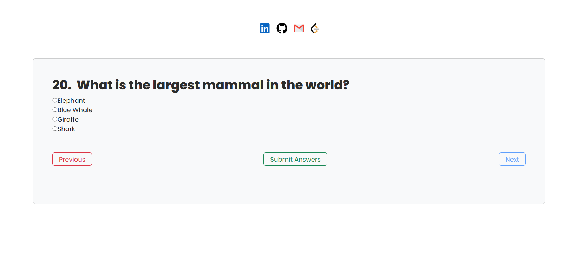
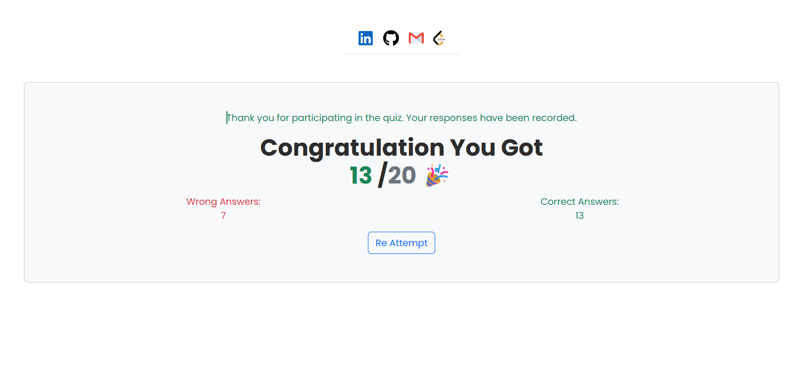

# Quiz App = Screenshot






A simple and interactive Quiz Application built with **React + Vite**, styled with **Bootstrap 5.3.7**, and enhanced with **React Icons**.
It allows users to answer multiple-choice questions, navigate between them, and view their final score with a dynamic pass/fail indicator.

---

## Features

* Multiple Choice Questions with single correct answer
* Previous / Next Navigation
* Score Calculation with dynamic color:

  * Green if passing
  * Red if failing
* Bootstrap Styling for responsive and clean UI
* Social Links using [React Icons](https://react-icons.github.io/react-icons/) (`FaLinkedin`, `FaGithub`)

---

## Tech Stack

* **Frontend Framework:** [React](https://react.dev/) with [Vite](https://vitejs.dev/)
* **Styling:** [Bootstrap 5.3.7](https://getbootstrap.com/)
* **Icons:** [React Icons](https://react-icons.github.io/react-icons/)

---

## Installation

1. **Clone the repository**

   ```bash
   git clone git@github.com:iuzaifa/react-apps.git
   cd quiz-app
   ```

2. **Install dependencies**

   ```bash
   npm install
   ```

3. **Run the development server**

   ```bash
   npm run dev
   ```

4. **Build for production**

   ```bash
   npm run build
   ```

> Please delete all other folders and keep only the Quiz App folder.

---


## Connect with Me

* [LinkedIn](https://www.linkedin.com/in/iiuzaifa/)
* [GitHub](https://github.com/iuzaifa)
* [Email](httpsmailto:abuhuzaifaw7@gmail.com)
* [Leetcode](https://leetcode.com/u/abuhuzaiifa/)
---

## License

This project is licensed under the — feel free to modify and use it.

